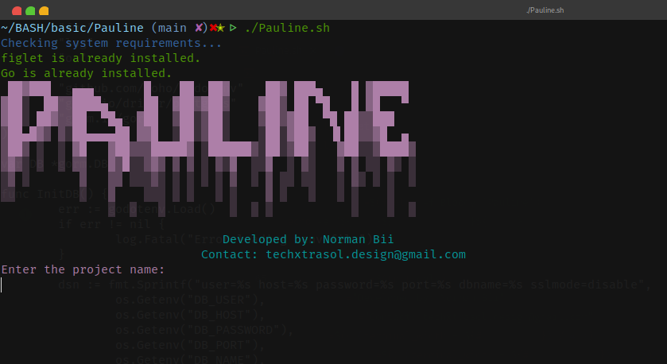

# Pauline - Go Project Bootstrapper

**Pauline** is a simple, user-friendly bash script designed to help Go developers quickly scaffold a Go API project with a structured folder layout and essential dependencies. It streamlines the setup process, allowing developers to focus on writing code rather than spending time on repetitive setup tasks.



## Table of Contents

- [Features](#features)
- [Prerequisites](#prerequisites)
- [Installation](#installation)
- [Usage](#usage)
- [Folder Structure](#folder-structure)
- [Generated Files](#generated-files)
- [Dependencies](#dependencies)
- [Contact](#contact)

## Features

- **Automated Setup**: Quickly set up a Go project with a predefined folder structure and necessary files.
- **Dependency Management**: Automatically installs Go dependencies such as GORM, JWT, bcrypt, and more.
- **Custom Project Name**: Allows the user to input a custom project name and Go module name.
- **Loader Animation**: Displays a loader animation while dependencies are being installed.
- **System Checks**: Checks if `figlet` and Go are installed, and installs them if necessary.
- **File Generation**: Inserts boilerplate code into the generated files based on folder names.

## Prerequisites

- **Bash**: Ensure your system has a bash environment (Linux or MacOS).
- **Go**: Go language should be installed on your system. If not, Pauline will automatically install Go.

## Installation

1. Clone this repository or download the script.
2. Make the script executable by running the following command:

```bash
chmod +x pauline.sh
```

3. Run the script using:

```bash
./pauline.sh
```

## Usage

1. Run the script and follow the prompts.
2. Provide the project name and Go module name when asked.
3. Pauline will:
   - Check if `figlet` and Go are installed.
   - Set up a Go project folder structure.
   - Initialize the Go module.
   - Install essential Go packages.
   - Create necessary files with boilerplate code.
   - Tidy up Go modules using `go mod tidy`.

### Example

```bash
./pauline.sh
```

**Example Output:**

```bash
Enter the project name:
> my-go-project

Enter the Go module name:
> github.com/username/my-go-project

Setup complete!
```

## Folder Structure

Pauline generates the following folder structure:

```
my-go-project/
│
├── cmd/
│   └── main.go
│
├── config/
│   └── config.go
│
├── controllers/
│   └── controllers.go
│
├── middleware/
│   └── middleware.go
│
├── models/
│   └── models.go
│
└── routes/
    └── routes.go
```

## Generated Files

### `cmd/main.go`

```go
package main

import (
    "fmt"
)

func main() {
    fmt.Println("Hello, World!")
}
```

### `config/config.go`

Contains the boilerplate for connecting to a PostgreSQL database using GORM and environment variables.

```go
package config

import (
    "fmt"
    "log"
    "os"
    "github.com/joho/godotenv"
    "gorm.io/driver/postgres"
    "gorm.io/gorm"
)

var DB *gorm.DB

func InitDB() {
    err := godotenv.Load()
    if err != nil {
        log.Fatal("Error loading .env file")
    }

    dsn := fmt.Sprintf("user=%s host=%s password=%s port=%s dbname=%s sslmode=disable",
        os.Getenv("DB_USER"),
        os.Getenv("DB_HOST"),
        os.Getenv("DB_PASSWORD"),
        os.Getenv("DB_PORT"),
        os.Getenv("DB_NAME"),
    )

    var dbError error
    DB, dbError = gorm.Open(postgres.Open(dsn), &gorm.Config{})
    if dbError != nil {
        log.Fatal("Failed to connect to the database", dbError)
    }

    fmt.Println("Database connected successfully!")
}
```

### `.env`

```env
DB_HOST=localhost
DB_PORT=5432
DB_USER=user
DB_PASSWORD=password
DB_NAME=database
```

### `.gitignore`

```gitignore
# Go binaries
*.exe
*.exe~
*.dll
*.so
*.dylib
*.test
*.out
# Logs
*.log
# Dependency directories
vendor/
# Environment files
.env
# Ignore docs folder
docs/
```

## Dependencies

Pauline automatically installs the following Go dependencies:

- [GORM](https://gorm.io) - The fantastic ORM library for Golang.
- [JWT](https://github.com/golang-jwt/jwt) - JWT implementation for Go.
- [Bcrypt](https://pkg.go.dev/golang.org/x/crypto/bcrypt) - Password hashing library.
- [Godotenv](https://github.com/joho/godotenv) - .env file loader.
- [Postgres Driver for GORM](https://gorm.io/docs/connecting_to_the_database.html) - PostgreSQL driver for GORM.

## Contact

Created by **Norman Bii**  
Email: [techxtrasol.design@gmail.com](mailto:techxtrasol.design@gmail.com)

Feel free to reach out if you have any questions or suggestions!

---

This `README.md` provides a detailed explanation of how to use **Pauline** and the expected project setup it generates.
